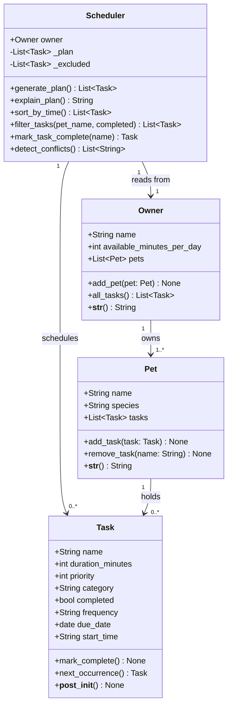

# PawPal+ (Module 2 Project)

You are building **PawPal+**, a Streamlit app that helps a pet owner plan care tasks for their pet.

## Scenario

A busy pet owner needs help staying consistent with pet care. They want an assistant that can:

- Track pet care tasks (walks, feeding, meds, enrichment, grooming, etc.)
- Consider constraints (time available, priority, owner preferences)
- Produce a daily plan and explain why it chose that plan

Your job is to design the system first (UML), then implement the logic in Python, then connect it to the Streamlit UI.

## What you will build

Your final app should:

- Let a user enter basic owner + pet info
- Let a user add/edit tasks (duration + priority at minimum)
- Generate a daily schedule/plan based on constraints and priorities
- Display the plan clearly (and ideally explain the reasoning)
- Include tests for the most important scheduling behaviors

## Features

- **Owner & multi-pet setup** — register an owner with a daily time budget and any number of pets
- **Task management** — add tasks with duration, priority (1–5), category, and frequency (once / daily / weekly)
- **Priority-based scheduling** — greedy planner fits the highest-priority tasks within the time budget
- **Time-sorted view** — scheduled tasks displayed in chronological HH:MM order
- **Recurring tasks** — completing a daily/weekly task auto-generates the next occurrence
- **Conflict detection** — window-overlap check flags any tasks whose time ranges collide
- **Filter view** — filter all tasks by pet name and/or completion status
- **Plain-English explanation** — scheduler explains why each task was included or excluded

## Final UML Diagram



## Getting started

### Setup

```bash
python -m venv .venv
source .venv/bin/activate  # Windows: .venv\Scripts\activate
pip install -r requirements.txt
```

### Suggested workflow

1. Read the scenario carefully and identify requirements and edge cases.
2. Draft a UML diagram (classes, attributes, methods, relationships).
3. Convert UML into Python class stubs (no logic yet).
4. Implement scheduling logic in small increments.
5. Add tests to verify key behaviors.
6. Connect your logic to the Streamlit UI in `app.py`.
7. Refine UML so it matches what you actually built.

## Smarter Scheduling

PawPal+ goes beyond a simple task list with four algorithmic features:

- **Priority-based planning** — tasks are scheduled greedily from highest (5) to lowest (1) priority until the owner's daily time budget is exhausted.
- **Time-sorted view** — `sort_by_time()` returns the plan in chronological order (HH:MM) so the owner sees tasks in the order they'll happen.
- **Filtering** — `filter_tasks(pet_name, completed)` lets you view tasks for a specific pet or only see what's still outstanding.
- **Recurring tasks** — tasks marked `frequency="daily"` or `"weekly"` automatically generate the next occurrence when completed via `mark_task_complete()`.
- **Conflict detection** — `detect_conflicts()` scans the scheduled plan for overlapping time windows and returns plain-English warnings instead of crashing.

## Testing PawPal+

Run the full test suite:

```bash
python -m pytest tests/test_pawpal.py -v
```

**What the tests cover:**
- `Task` validation (priority, duration, frequency bounds)
- `mark_complete()` status change
- Recurrence: daily → +1 day, weekly → +7 days, one-off → no recurrence
- `Pet` add/remove task count
- `Scheduler` time-budget enforcement, priority ordering, start-time assignment
- Sorting correctness, pet/status filtering
- Conflict detection (no conflicts on clean plan; flags manual overlaps)

**Confidence level: ★★★★☆** — all 21 tests pass; edge cases like empty task lists and one-off vs recurring tasks are covered. Would add tests for the Streamlit UI layer and multi-owner scenarios with more time.
